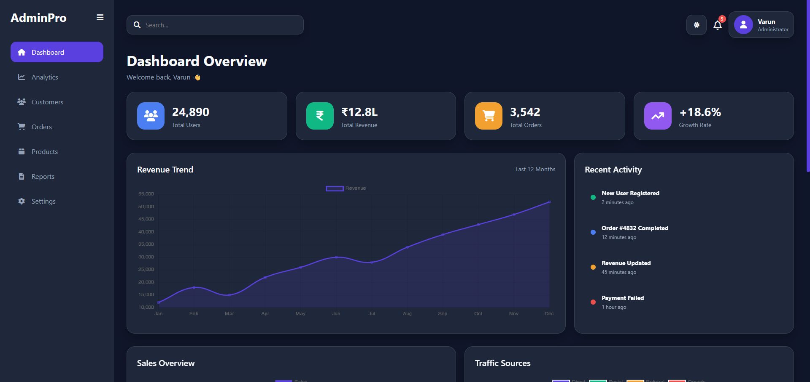
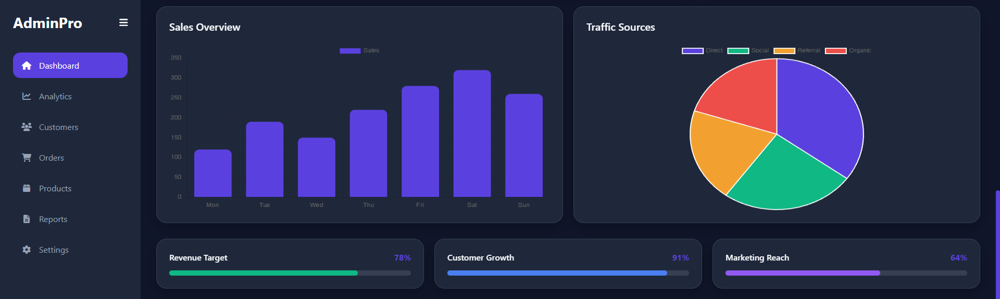
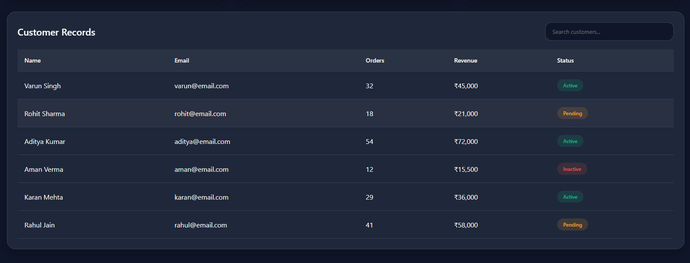
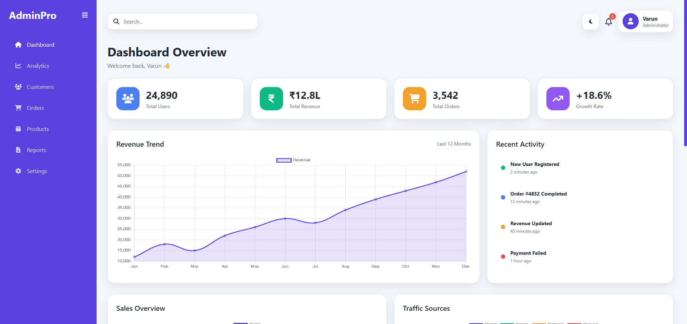
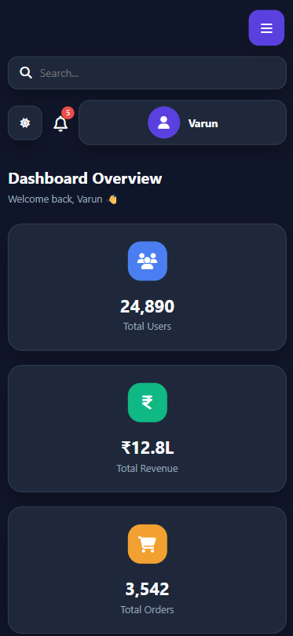

# 📊 AdminPro Dashboard Analytics Panel

A modern and responsive Admin Dashboard built using HTML, CSS, and JavaScript. The dashboard provides a clean user interface for monitoring analytics, managing customer data, and visualizing business performance through interactive charts.

## 🚀 Features

- 📈 Revenue Analytics Dashboard
- 📊 Interactive Charts (Line, Bar & Pie Charts)
- 👥 Customer Management Table
- 🔍 Search and Filter Functionality
- 🌙 Dark / Light Mode Toggle
- 📱 Fully Responsive Design
- 📋 Progress Tracking Cards
- 🔔 Notification Section
- 📂 Collapsible Sidebar Navigation
- 🎨 Modern SaaS-Inspired UI Design
- ⚡ Smooth Animations and Transitions

## 🛠️ Technologies Used

- HTML5
- CSS3
- JavaScript (ES6)
- Chart.js
- Font Awesome

## 📱 Responsive Design

The dashboard is optimized for:

- Desktop Screens
- Laptops
- Tablets
- Mobile Devices
- Small Mobile Screens

## 📂 Project Structure

```text
Admin-Dashboard/
│
├── index.html
├── style.css
├── app.js
└── README.md
```

## 🎯 Learning Outcomes

This project helped in understanding:

- Dashboard Layout Design
- Responsive Web Development
- Data Visualization using Charts
- CSS Grid & Flexbox
- DOM Manipulation
- Theme Switching (Dark/Light Mode)
- Interactive User Interfaces

## 📸 Preview

### Dashboard Overview



### Analytics Charts



### Customer Records



### Dark Theme


### Light Theme



### Mobile View




## 🔮 Future Improvements

- Real API Integration
- Authentication System
- Export Reports Feature
- Advanced Data Filtering
- User Management Module
- Dashboard Customization Options

## 👨‍💻 Author

**Varun Singh**

BCA Student | Frontend Developer

---

⭐ If you like this project, consider giving it a star on GitHub.
